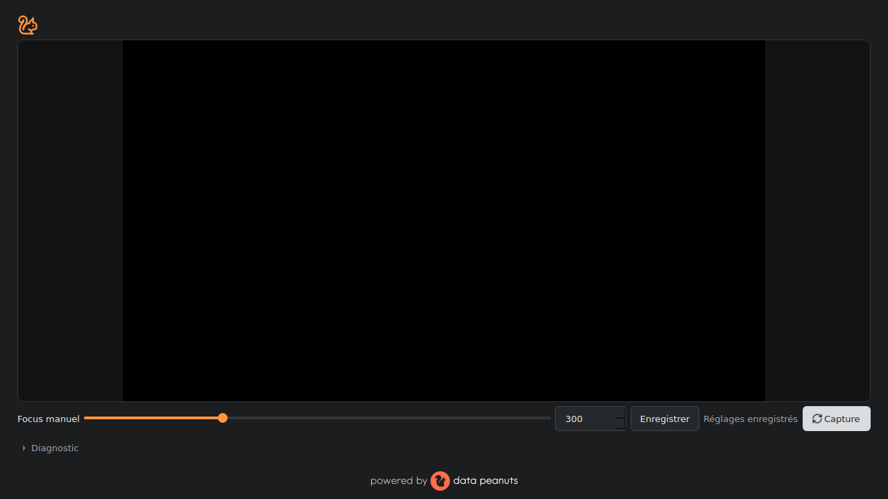
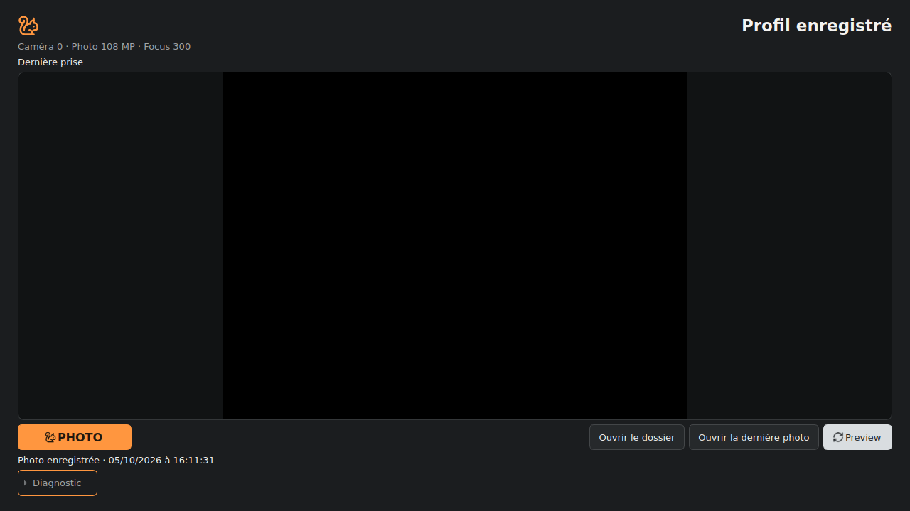

# arducam_photo

Lightweight, importable one-shot photo capture for the Arducam B0494C (108 MP UVC), Windows 11 x64.
The repository has three layers: the **library** (`arducam_photo`), the **CLI examples** (`examples/`) and the **graphical app** (`arducam_photo.app`, PySide6). No Streamlit, browser, server, SQLite or installer.

## API

```python
from arducam_photo import CaptureConfig, capture, save_png

cfg = CaptureConfig(camera_index=0, api="msmf", path="native_108mp",
                    focus=187, ccm_path=r"C:\arducam\arducam_108mp.json")
result = capture(cfg)            # blocking: run it outside your UI thread
result.image                     # BGR uint8, 9000 x 12000 x 3 (width 12000, height 9000)
result.info                      # frozen config copy, settings, read counts, ccm_applied, duration
save_png(result.image, r"C:\photos\a.png")   # optional helper
```

- `CaptureConfig`: `camera_index`, `api` (`msmf` reference), `path` (four modes below, always explicit, no fallback), `focus`, `exposure`, `auto_exposure`, `auto_exposure_mode`, `gain`, `auto_wb`, `auto_wb_mode`, `wb_temperature`, `brightness`, `contrast`, `saturation`, `fps`, `ccm_path`, `apply_ccm`, `stabilization_reads` (default 5, manufacturer starting point, not universal), `max_failed_reads`, `max_invalid_buffers`.
- `capture(config, cancel_event=None)` → `CaptureResult(image, width, height, info)`. Errors, all `CaptureError` subclasses: `CaptureConfigError`, `CaptureBusyError`, `CaptureCancelled`, `CameraOpenError`, `CameraSetupError`, `CameraReadError`, `RawBufferError`, `IspError`, `SaveError`.
- `save_png(image, path, overwrite=False)`: colour or grayscale uint8, temp file in the same directory, decode-back verification, never replaces an existing file unless `overwrite=True`.
- `acquire(config)` returns owned original pixels and acquisition information, **after releasing the camera**, without ISP or storage. `capture()` remains a rendering facade, not an archival API; use `capture_and_save()` or the GUI for automatic original archival.
- Import has no side effects. Camera acquisition is exclusive per process (`CaptureBusyError`); the GUI additionally serializes acquisition and processing jobs. The camera is opened and released inside each acquisition. Library callers should likewise serialize large rendering jobs to bound memory.

## Paths

| Mode | Data actually validated | Reference rate, not a guarantee |
| --- | --- | --- |
| `color_720p` | 1280×720, uint8 BGR, 3 channels | USB 3 up to 60 fps; USB 2 10 fps |
| `color_4k` | 3840×2160, uint8 BGR, 3 channels | USB 3 10 fps |
| `color_12mp` | 4000×3000, uint8 BGR, 3 channels | USB 3 7 fps |
| `native_108mp` | RAW transport 6000×9000, reconstructed Bayer 12000×9000 | approximately 1 fps announced |

The default requested rates are conservative (10/10/7/1 fps respectively), not latency promises. An explicit rate remains a request: requested, accepted and reported values are recorded separately. The application does **not** measure USB speed, assume identical fields of view, substitute a different resolution/API or treat `cap.set()`/`cap.get()` as proof. Actual buffers must match shape, dtype, channels and byte size.

**native_108mp** (USB 3 required): requests 6000×9000 with `CAP_PROP_CONVERT_RGB=0`, validates **uint8, 108 000 000 bytes**, reconstructs 9000 rows × 12000 columns without adding pixels, copies the original and releases the camera. The accepted transport is **8-bit uint8**: this is not a claim to archive 12/14-bit sensor data or to know the sensor's native depth. Neither 6000×9000 nor 9000×6000 is a native colour mode.

The reference render remains saturating black subtraction 16, `COLOR_BayerGR2RGB` demosaic, then CCM at 4000 K. Its output is used as **BGR**, preserving the existing convention. Synthetic colour-site tests verify the software mapping; the physical Bayer convention and colour accuracy still need a hardware colour-chart check.

`info.settings` distinguishes the requested value, whether a command was attempted, `cap.set` result, read-back, exceptions/availability, and known mode. These controls are shared by Preview and one-shot acquisition. Empty/`None` values mean leave the control untouched; read-back `0` is retained as a value, not treated as unsupported. A read-back or accepted command is not proof of physical effect.

OpenCV exposes these controls through backend-specific `CAP_PROP_*` properties; the code does not invent ranges, units, or automatic/manual toggle values. UI auto-mode values are the raw numeric value required by the selected backend. Select *Automatic* or *Manual* explicitly only after consulting that backend/driver's documented value; incompatible manual exposure/gain or white-balance-temperature commands are then disabled and not attempted. If a property constant is missing, `cap.set()` returns false, or a read fails, the report identifies that limitation instead of claiming it was applied. OpenCV index/API identity is the only camera identity currently available. No autofocus is assumed: focus remains manual motorized.

Blocking native calls (no interruptible timeout): `VideoCapture` open, `set`, `read`. Cancellation (`cancel_event`) is only checked between them; stabilization is bounded by read counts. COM: handled by OpenCV MSMF in the calling thread; the module does not call COM.

## CCM tuning file (`arducam_108mp.json`)

- The existing tracked tuning file is bundled at `src/arducam_photo/resources/arducam_108mp.json`, with its contents unchanged. `.gitignore` allows this specific resource while excluding other files with the same name.
- For the library and CLI, pass this file or your own tuning file via `ccm_path` / `--ccm`; the capture engine still requires an explicit path.

**Default in the GUI**: the app uses the package resource `src/arducam_photo/resources/arducam_108mp.json` (loaded via `importlib.resources`, independent of the current directory; included in wheels through `pyproject.toml`). No file selection is required at first launch. Choosing another file ("Avancé : utiliser un autre arducam_108mp.json…") is an optional override and takes priority over the resource. A missing/invalid CCM prevents only the render that requires it, **not acquisition or original archival**; correction is never silently disabled. Typical flow: `git pull`, `pip install .[gui]`, `arducam-capture`.
- Validated: JSON object with non-empty `ccms`, each entry `ct` (positive, strictly increasing) and `ccm` (9 finite numbers). The interpolation temperature is explicit in Traitement; `info.ccm_applied` records whether correction ran.

## References and licence

Reference demo: https://github.com/ArduCAM/ArducamUVCPythonDemo (branch `Arducam108MPDemo`, commit `b6c599c…`; files `arducam_demo.py`, `camera.py`, `isp.py`, `utils.py`) and the Windows quick-start guide at docs.arducam.com. The licence could not be verified from the sandbox (network blocked); no manufacturer code was copied. The tuning resource is the existing repository file, relocated without changes. The sequence (CONVERT_RGB=0, 5 stabilising reads, reshape 9000×12000, −16, BayerGR2RGB, CCM at 4000 K with the reference interpolation/rot180/transpose) was re-implemented. The CCM is applied in float32 by 256-row chunks (the reference uses float64 over the whole image); expect tiny rounding differences. Do not mix OpenCV distributions providing `cv2`.

## Windows PowerShell hardware test

```powershell
git clone https://github.com/MJOpeanuts/arducam_photo; cd arducam_photo
# Use the reviewed PR branch or main once merged.
py -3.12 -m venv .venv; .\.venv\Scripts\Activate.ps1
pip install -e ".[test]"
python -c "import cv2,numpy;print(cv2.__version__,numpy.__version__)"   # expect 5.0.0 / 2.5.3 (opencv-python 5.0.0.93)
pip list | findstr /i opencv                                             # exactly one distribution
$ccm = (Resolve-Path ".\src\arducam_photo\resources\arducam_108mp.json").Path
Test-Path $ccm   # or explicitly select your own tuning file
python examples\capture_cli.py --path native_108mp --ccm $ccm --focus 187 -o $env:TEMP\n1.png -v
python -c "import cv2;i=cv2.imread(r'$env:TEMP\n1.png');print(i.shape)"  # (9000, 12000, 3)
ii $env:TEMP\n1.png
# Inspect the matching UUID-prefixed .raw/.json/.png files in the selected output folder.
# Repeat with color_720p: JSON must say RAW unavailable and there must be no .raw.
1..3 | % { python examples\capture_cli.py --path native_108mp --ccm $ccm -o $env:TEMP\s$_.png }
python examples\capture_cli.py --path color_720p -o $env:TEMP\p720.png
python examples\capture_cli.py --path color_4k --fps 10 -o $env:TEMP\p4k.png
python examples\capture_cli.py --path color_12mp --fps 7 -o $env:TEMP\p12mp.png
python examples\use_as_library.py $ccm $env:TEMP\lib.png
```
Close any camera app first; the capture bundle is never overwritten. The optional CLI export
path remains a separate convenience image; use the matching capture UUID files as the traceable set.
On the real B0494C/Windows backend, consult its documentation for exact auto/manual property values
before selecting a mode or typing a raw mode command. Confirm the manifest reports attempted,
accepted and read-back values separately, inspect the raw checksum/byte count, test a rendering
failure and a no-overwrite collision, and verify the camera is released. Simulated tests do not
validate driver support, units, physical Bayer pattern, exposure, focus or color.

## Status

| | |
|---|---|
| Implemented | four modes, raw/JSON/PNG capture bundles, original archival, offline recipes, three-tab GUI, PNG/JPEG outputs, CLI + library example, Windows CI workflow |
| Automated coverage (simulated camera, tiny Bayer images) | setting order and failures, auto/manual incompatibility, legacy profile loading, bundle bytes/hash/strict JSON/partial state/no-overwrite, 720p without RAW, plus acquisition and UI regressions |
| Historical ISP measurement (base, Linux sandbox, synthetic) | 9000×12000 incl. CCM: ~0.6 s, ~0.76 GB peak RSS; not an end-to-end archival/processing benchmark or representative of Windows |
| Tested on hardware | **nothing yet** (no camera in Codespace) |
| To verify on hardware | direct native capture, 12000×9000 content, focus/colour vs. demo, successive captures, camera freed, all colour modes and actual framing, offline reprocessing, portable Windows |

The milestone is **not** validated by simulated tests alone.

## Graphical application (PySide6)

Install and run (Windows, no PowerShell activation required for the `.cmd`):

```
py -3.12 -m venv .venv
.venv\Scripts\python.exe -m pip install -e ".[gui]"
.venv\Scripts\python.exe -m arducam_photo.app        # single documented command
run_arducam_capture.cmd                                 # double-click launcher
```

Quick trial on your PC: close other camera apps, start the app, choose *Photo 108 MP*, pick the camera (use "Détecter" if needed; the index is not a stable identity), leave the bundled CCM selected by default, open **Preview / Réglages**, set the focus (0–1023, numeric + slider; no autofocus or calibrated distance), optionally expand **Autres réglages caméra**, **Enregistrer**, go to **Capture**, press **PHOTO**. Each successful photo writes `<capture_id>.raw`, `<capture_id>.json`, and `<capture_id>.png` in the chosen photo folder; 720p writes JSON and PNG only. Existing files are never overwritten.

**Navigation.** Start: nothing is opened. **Preview** keeps the existing image, focus controls, profile save and save/discard/stay prompt; the framing preview is not a claim about the photo mode's field of view. Leaving it closes and releases the stream. **Capture** has no live video while waiting; its compact mode selector is explicit and an incompatible saved profile cannot be silently reused. PHOTO freezes the configuration. A second trigger and incompatible transitions are refused while work runs. Capture retains the last still image after success or recoverable error and never restarts Preview automatically. **Traitement** loads and processes files without camera access; returning to Capture does not open a stream.

**Architecture.** Qt-free: `engine.py` acquires, `archive.py` and `storage.py` store/verify, `processing.py` describes reproducible recipes, `app/profile.py` keeps injectable JSON profiles in `%LOCALAPPDATA%\ArducamCapture`, `app/preview.py` adapts the preview, `app/controller.py` serializes worker jobs and `app/model.py` orchestrates modes. Qt: `app/widget.py` and the processing view. One latest preview frame and one outstanding notification prevent a backlog. File loading, ISP and writing stay off the GUI thread; processing concurrency is bounded. Display images are owned copies, not references to driver buffers. Old profiles remain readable with explicit defaults; changing the acquisition mode requires compatible settings. Corrupt profile/settings JSON files are kept (renamed `.corrupt-*`), never deleted.

### Original archival and offline processing

The GUI and `capture_and_save()` follow this order: configure/acquire → validate and own pixels → release camera → publish capture RAW/JSON → archive original → render → verify/write output. Each successful capture has a common UUID prefix for the three files. `.raw` is headerless C-order uint8 bytes of the unchanged 9000 × 12000 Bayer array; the JSON records its dimensions, organization, size and SHA-256. The code's existing reference pipeline maps the synthetic sites to an RGGB software convention (`COLOR_BayerGR2RGB` output is treated as BGR); the physical sensor pattern is not hardware-validated. 720p explicitly records that no native RAW exists. The existing per-acquisition folder (`original.npy` / `original.png` and `acquisition.json`) remains available for offline processing.

The per-capture JSON schema version 1 separates `acquisition` from `processing`. It records capture ID/timezone, program version/commit when available, camera index/backend, mode, transport/image geometry, requested controls and reports, readback time (not a guaranteed synchronized sensor measurement), stabilization counts, RAW format/checksum and processing recipe, black level, demosaic, CCM temperature/matrix and tuning-file fingerprint. Unknown identity/readback data are null. The internal acquisition manifest continues to record detailed archival/output timings and offline provenance.

The capture writer uses same-directory temporary files and verifies RAW size/hash and strict JSON correspondence before publishing; files are published individually, not as an atomic multi-file transaction. A hidden `.<capture_id>.incomplete` marker remains until JSON and PNG are verified and the final JSON is committed, so partial triplets are detectable. A RAW/JSON pair is saved before rendering. If rendering/PNG writing fails, the pair remains, the JSON records `processing.status=failed`, and the UI reports that RAW was preserved but processing failed. If storage fails, the capture is reported as failed; recoverable temporary/original data are not silently removed by the capture-bundle writer. An incomplete or incompatible capture is never announced as successful.

No-overwrite publication requires filesystem hard-link support (for example NTFS); unsupported filesystems fail explicitly rather than risk replacing an original. A driver release exception is reported separately: validated pixels can still be archived, but further camera access is refused until application restart because exclusive ownership is no longer provable.

1. In Capture, use the direct action to open the last acquisition in **Traitement**, or open an existing `acquisition.json` / original file there. Ordinary colour PNG/JPEG images can also be loaded.
2. Disconnect the camera: all following steps work without it.
3. For RAW, select **minimal demosaic**, **black level + demosaic without CCM**, or the **reference recipe** (black 16 + demosaic + CCM 4000 K). Advanced settings allow an explicit black level, CCM toggle and interpolation temperature. The source comparison is labelled as a **minimal RAW render**, not a colour photograph of the Bayer mosaic.
4. Colour operations are opt-in: grayscale, parameterized CLAHE, Otsu/adaptive threshold and aspect-preserving reduction. No automatic threshold or compulsory correction chain, generated detail, super-resolution or automatic quality selection.
5. Compare source/result with synchronized zoom and pan. The display may use bounded-size views; saved outputs use the recipe's actual dimensions.
6. Save a **new** PNG (colour/grayscale) or JPEG (configurable quality); source id, recipe and output parameters accompany it. PNG is checked pixel-for-pixel; JPEG is checked for decodability and dimensions, not equality. Reducing a result does not create an acquisition mode. No implicit cropping is performed.

This remains a local camera/photo utility: no campaigns, experiments, annotations, OCR, cloud, server or database. Keep trial notes in Notion.

**Limits.** OpenCV open/set/read/release are native and non-interruptible: no effective timeout or cancellation is promised; closing the window waits (up to 10 s) for the worker and cannot abort a blocked call. If that shutdown wait expires, controls are disabled; a nonblocking Qt timer checks worker completion and the application exits automatically after the worker finishes and releases the camera. A permanently blocked native call can still prevent exit. The 14.2 s of the first test is neither a guarantee nor an end-to-end UI measure. The "last photo" shown is from the current session only. USB speed is never measured. Do not mix OpenCV distributions.

**Tests run (Linux sandbox, simulated camera, `python -m pytest`, offscreen Qt):** engine/storage regressions, preview/capture transitions, no reads while waiting in Capture, no automatic preview, profile save/reload, unsaved-change decisions, saved focus passed to the engine, frozen profile, mutual exclusion, error/camera release, double trigger, clean shutdown, QImage buffer lifetime. The Windows CI workflow runs the same suite; no Windows run was done here.

**Hardware validation still to do:** 30-minute preview; visual focus tuning; profile persistence after relaunch; 20 consecutive captures; dimensions, sharpness, colours; UI responsiveness, memory, latency; disconnect/reconnect; close without leaving the camera busy. The app is **not** validated on hardware.

### Présentation Preview / Capture

- Interface anthracite, Segoe UI, image dominante sur fond sombre, sans étirement ni recadrage. Redimensionner ne change ni la résolution ni la cadence caméra. Le plein écran concerne toute la fenêtre `QMainWindow`, pas un dialogue de preview : **F11** bascule dans tous les modes, **Échap** quitte le plein écran, en restaurant la fenêtre normale (géométrie comprise) ou maximisée précédente. Les commandes restent accessibles.
- L'icône originale **Nuts** (`nuts-app.svg`, `.png`, `.ico`) identifie l'application et l'exécutable ; elle n'est pas remplacée par l'écureuil Lucide. L'en-tête reste minimal, avec un petit écureuil. Le pied de page affiche l'image originale `powered by_white.png`, sans réseau.
- Sous le preview : focus manuel, **Enregistrer**, un seul statut de sauvegarde et **Capture** (gris clair, changement de mode uniquement). Sous la dernière photo : **PHOTO** (orange), deux boutons d’ouverture de style identique, **Preview** (gris clair).
- **Diagnostic**, fermé initialement, regroupe FPS, consigne/lecture de focus et limites de vérification, backend, chemins, correction couleur, dimensions, durées et détails des erreurs, ainsi que **Plein écran**, **Démarrer en plein écran** et **Quitter**. Le démarrage en plein écran est une préférence persistante, désactivée par défaut ; basculer avec F11 ne change pas cette préférence. Quitter utilise la même fermeture contrôlée que la fenêtre. Une erreur bloquante garde un résumé visible hors Diagnostic.
- Les SVG officiels `squirrel` et `refresh-cw` proviennent de [Lucide 0.468.0](https://github.com/lucide-icons/lucide/tree/0.468.0/icons). Ils sont embarqués dans le package avec leur [notice ISC](src/arducam_photo/resources/icons/LICENSE), sans accès réseau au lancement.

Tests d’interface (Linux Qt offscreen ; aucune caméra nécessaire) :

```sh
PYTHONPATH=src QT_QPA_PLATFORM=offscreen python -m pytest
PYTHONPATH=src QT_QPA_PLATFORM=offscreen QT_SCALE_FACTOR=1.25 python -m pytest tests/test_widget.py
PYTHONPATH=src QT_QPA_PLATFORM=offscreen QT_SCALE_FACTOR=1.5 python -m pytest tests/test_widget.py
python -m pip wheel . --no-deps -w dist/wheels
```

Validation historique de la base `833e50f` sous Linux Qt offscreen à 100 % : **108 tests réussis**, en exécutions séparées (**68 tests hors interface**, dont les 15 tests de packaging, et **40 tests GUI**). Les **40 tests GUI avaient aussi réussi aux facteurs Qt 125 % et 150 %**. Ces chiffres décrivent la base, pas une validation matérielle ni les nouveaux tests de cette PR. Aucun résultat Windows ni validation d'un véritable exécutable Windows n'est revendiqué.

Ces tests couvrent l’unicité du statut (y compris un échec de sauvegarde), le focus restauré, le redimensionnement sans nouvelle frame, les proportions, le Diagnostic, les ressources SVG, les états normal/survol/focus/désactivé, les boutons d’ouverture et les transitions du contrôleur. Les nouveaux cas vérifient le démarrage en plein écran désactivé par défaut puis activé après relance ; F11/Échap dans les deux modes, avec restauration normale/maximisée puis démaximisation ; l'absence de changement des opérations caméra du véritable contrôleur avec caméra simulée ; les noms exacts des ressources manquantes et les octets/pixels originaux ; le pied de page dans les limites de la fenêtre ; les protections de fermeture, y compris un délai de shutdown dépassé. Les commandes restent accessibles dans les zones logiques 1280 × 720, 1024 × 576, 854 × 480 et 838 × 400 (marge pour la barre des tâches et les décorations), sans agrandissement forcé de la fenêtre, même Diagnostic ouvert.

Tests ciblés exécutés pour cette PR dans le sandbox Linux, avec NumPy 2.5.3, OpenCV 5.0.0 et PySide6 6.11.2 :

| Commande | Résultat |
| --- | --- |
| `python -m pytest tests/test_engine.py tests/test_processing.py -q` | 111 réussis |
| `python -m pytest tests/test_storage.py tests/test_archive.py -q` | 68 réussis |
| `python -m pytest tests/test_cli.py -q` | 6 réussis |
| `python -m pytest tests/test_packaging.py -q` | 16 réussis, wheel construit et ressources vérifiées |

Les essais de caméra utilisent des doubles et de petits buffers synthétiques. Aucun essai B0494C, benchmark USB ni exécutable Windows n'est validé par ces résultats.

Les facteurs Qt sous Linux ne remplacent **pas** une validation Windows : reconstruire puis vérifier l'exécutable, l'icône de fenêtre/barre des tâches, Segoe UI, survol/focus/désactivation, plein écran et absence de texte coupé sur un écran Windows 1280 × 720 à chaque mise à l'échelle réelle 100/125/150 %, ainsi que tous les essais matériels ci-dessus. Ces validations Windows et caméra physique restent à faire.

Tests de packaging historiques de la base sous Linux : **15 réussis**
(`PYTHONPATH=src python -m pytest tests/test_packaging.py -q`).
Ils construisent un wheel, vérifient les octets des originaux, les chargent hors
du dépôt et vérifient la spécification (onedir, sans console, ICO, hooks Qt,
noms précis des fichiers manquants). Ils ne lancent pas PyInstaller sur Windows.

Captures historiques de la base, du **rendu réel Qt**, à 1280 × 720, issues du test de transitions avec caméra simulée (frames noires), et non de maquettes. Elles ne représentent pas le nouvel onglet Traitement. L’heure affichée vient du fichier produit par le test ; aucune image de démonstration n’est chargée par l’application.

| Preview / Réglages | Capture après enregistrement |
| --- | --- |
|  |  |

### Build Windows autonome (PyInstaller, onedir)

Construire **sur Windows x64**, avec **Python 3.12 x64** ; PyInstaller ne compile
pas un exécutable Windows depuis Linux. Les commandes suivantes nécessitent
Internet sur le PC de construction. Depuis la racine du dépôt, dans PowerShell :

```powershell
py -3.12 -c "import struct; assert struct.calcsize('P') * 8 == 64, 'Python x64 requis'"
py -3.12 -m venv .venv-build
.\.venv-build\Scripts\python.exe -m pip install ".[gui]" pyinstaller==6.22.3
.\.venv-build\Scripts\python.exe -m pip freeze --all > build-environment.txt
.\.venv-build\Scripts\python.exe -m PyInstaller --clean --noconfirm arducamcapture.spec
& ".\dist\ArducamCapture\ArducamCapture.exe"
```

Pour lancer **depuis les sources** (Python nécessaire), utiliser les commandes
de la section « Graphical application » ou, après cette installation :
`.\.venv-build\Scripts\python.exe -m arducam_photo.app`.
Après toute modification des sources, des ressources ou de la spécification,
**reconstruire l'exécutable** avec la commande PyInstaller ci-dessus ; un ancien
`.exe` ne lit pas les nouveaux fichiers du dépôt.

Les dépendances GUI ont des bornes minimales, pas un verrouillage complet :
conserver `build-environment.txt`, le commit (`git rev-parse HEAD`), la version
exacte de Python (`.\.venv-build\Scripts\python.exe --version`) et la version de
Windows avec le livrable. Pour reproduire les versions dans un environnement
neuf Python 3.12 x64, installer ce fichier avec
`python -m pip install -r build-environment.txt`, puis le même commit avec
`python -m pip install --no-deps --no-build-isolation ".[gui]"` avant PyInstaller. La ligne locale
`arducam-photo @ file:///...` produite par `pip freeze` peut pointer vers le
dépôt du premier PC : la retirer de la copie utilisée pour la réinstallation,
puis installer le commit local comme indiqué. Ce gel reproduit les versions,
il ne garantit pas des exécutables identiques octet pour octet.

La spécification remplace `ArducamCapture.spec`. Elle produit un dossier
`dist\ArducamCapture`, **pas** un exécutable onefile : distribuer le dossier
entier, y compris `_internal`. Le lanceur appelle le même point d'entrée GUI ;
aucun changement du moteur caméra, des profils ou du dossier des photos.
L'exécutable est sans console (`console=False`). Les hooks PyInstaller
embarquent NumPy, OpenCV et PySide6 ; la spécification demande explicitement
QtCore, QtGui, QtWidgets et QtSvg pour activer les hooks nécessaires, notamment
le rendu SVG, les plugins d'images et le plugin de plateforme Windows.
Toutes les ressources du package sont incluses à leur emplacement relatif :
JSON couleur, SVG, icônes PNG/ICO, notice des icônes et image de marque.
Le JSON par défaut reste chargé via `importlib.resources`, indépendamment du
répertoire de lancement ; l'ICO sert aussi d'icône de l'exécutable Windows.
Si un original manque, la construction s'arrête en indiquant son chemin exact,
y compris `icons/nuts-app.svg`, `icons/nuts-app.png`, `icons/nuts-app.ico` ou
`src/arducam_photo/resources/powered by_white.png` (espace conservé).

Le workflow **Windows onedir package** construit sur Windows, vérifie la
présence des ressources et publie le dossier complet comme artifact
`ArducamCapture-windows-x64-onedir` (conservé 7 jours).
Ni `.venv`, ni `.venv-build`, ni `build`, ni `dist`, ni `build-environment.txt`,
ni les photos utilisateur ne sont à versionner. `.venv-build` et le gel sont
des fichiers locaux de construction ; ne pas les ajouter au dépôt.

**Utilisation portable hors ligne sous Windows 11 x64, sans Python :** copier
ou extraire le dossier complet `ArducamCapture` sur le PC cible ; double-cliquer
`ArducamCapture.exe`, ou lancer dans PowerShell :

```powershell
& "C:\Applications\ArducamCapture\ArducamCapture.exe"
```

Aucune installation de Python, pip ou connexion Internet n'est nécessaire
pour ce dossier construit ; ne pas copier seulement le `.exe`, ne pas supprimer
`_internal`, ne pas utiliser le lanceur source `.cmd`. Le pilote UVC et le
matériel caméra doivent toujours être disponibles sur le PC.

Avant distribution : extraire l'artifact entier sur un PC Windows 11 x64 sans Python,
déconnecté du réseau, lancer depuis un autre répertoire, vérifier l'icône Nuts,
le pied de page et le JSON par défaut ; vérifier F11/Échap depuis fenêtre normale
et maximisée, le démarrage en plein écran persistant et Quitter,
puis tester preview, focus, les quatre modes, archivage, retraitement, relance et libération
de la caméra avec le matériel réel. Les tests de packaging Linux vérifient les
ressources originales du wheel et les options de la spécification ; ils ne
construisent ni ne valident un exécutable Windows. Un build réussi et des tests
Qt offscreen ne valident pas ces essais physiques Windows.

### Recette matérielle Windows restante

- Tester 720p, **4K et 12 MP** sur la B0494C ; comparer les dimensions **réellement reçues**, les détails et le cadrage de chaque mode (ne pas supposer un champ de vue commun). Essayer la cadence demandée et conserver sa valeur relue, sans en déduire la vitesse USB.
- Archiver un RAW natif, vérifier le `.npy` et le JSON, **débrancher la caméra**, puis le rouvrir et enregistrer plusieurs recettes et sorties PNG/JPEG sans toucher à l'original.
- Photographier une mire pour confirmer le motif Bayer, l'ordre BGR/RGB, les couleurs et l'effet de la CCM/noir ; les tests synthétiques ne valident pas la caméra.
- Répéter au moins 20 captures, surveiller mémoire/réactivité et timings Diagnostic, fermeture/libération, déconnexion/reconnexion et erreurs de disque plein.
- Tester les trois onglets, les décisions de profil non enregistré, la dernière image après erreur, F11/Échap et les échelles Windows 100/125/150 %.
- Construire le portable sur Windows, copier **tout** le dossier hors du dépôt sur un PC sans Python et hors réseau, puis tester démarrage, ressources transparentes, archivage et retraitement caméra débranchée.
